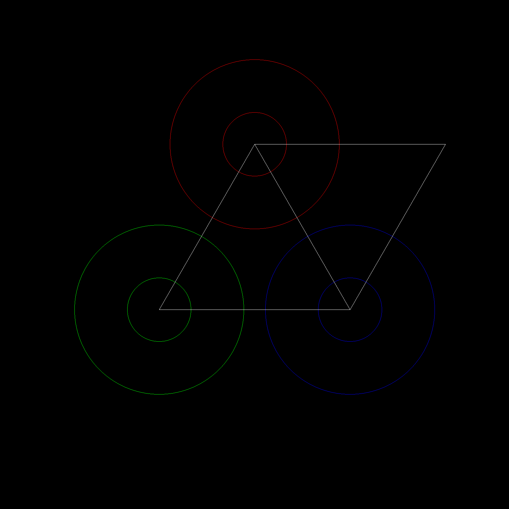
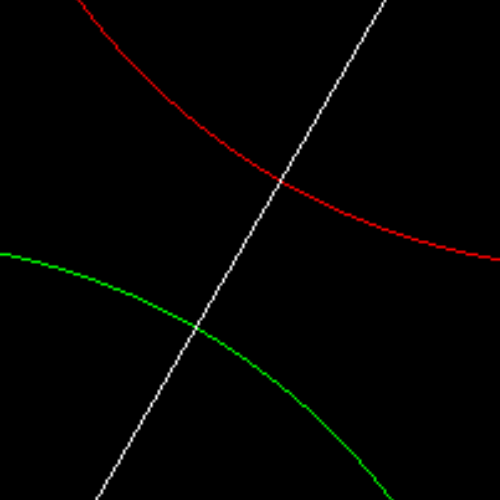
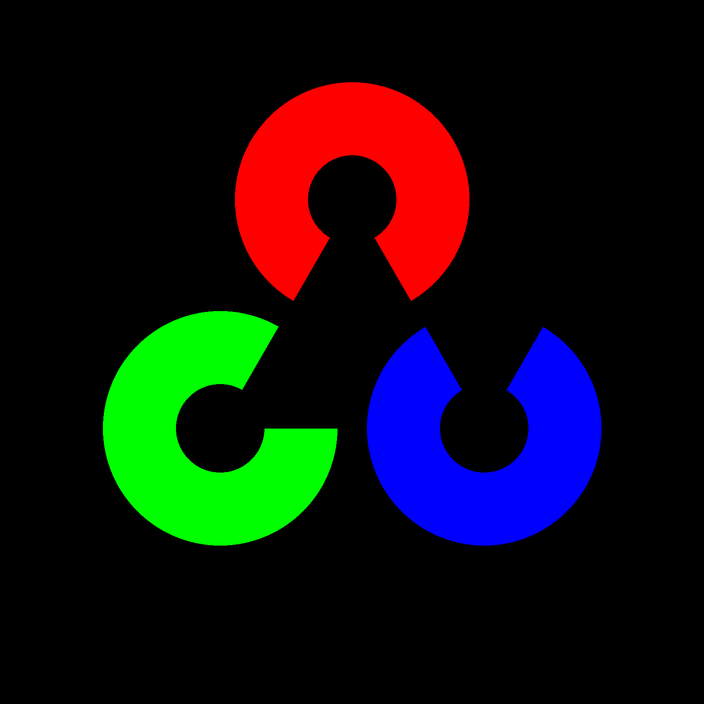
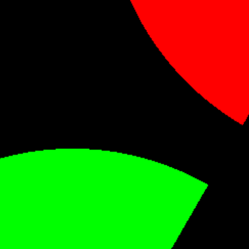
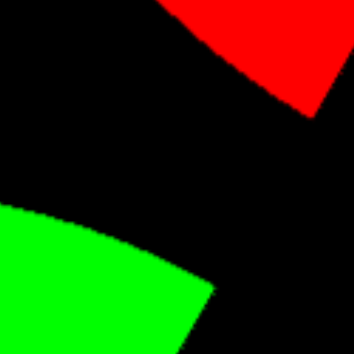

# 光栅图形学作业

郑林楷	2017011474	2019-04-07

## 选题

选题为区域填充，顺便把画线的功能实现了。

编程语言使用的是 ``C++``，第三方库为 ``OpenCV``，IDE 为 ``VS2017``。

所有代码位于 ``main.cpp`` 内。

## 基础功能

实现了两个类：``Circle`` 和 ``Polygon``，画线和区域填充分别在各个类中实现。

### 画线

实现画线的函数为 ``drawEdge(img,r,g,b)``，作用为描绘图形的边缘部分。``Circle`` 类使用的是中点画圆法，``Polygon`` 类使用的是 Bresenham 算法。

实现效果如下图图一所示。

放大后可以看到毛刺效果，如下图图二所示。

### 区域填充

实现函数为 ``drawInside(img,r,g,b)``，作用为使用特定颜色填充图形内像素。``Circle`` 类和``Polygon`` 类使用的都是队列实现的区域填充算法。

实现效果如下图图三所示。

放大后依旧可以看到毛刺效果，如下图图四所示。

## 拓展功能

### 反走样

这里的反走样使用了卷积操作使图像平滑，其中卷积核为

$$
\begin{bmatrix}
	1 & 2 & 1 \\
	2 & 4 & 2 \\
	1 & 2 & 1 \\
\end{bmatrix}
$$
实现效果如下图图五所示（一个 OpenCV Logo）。

放大后的边缘显得平滑，如下图图六所示。

